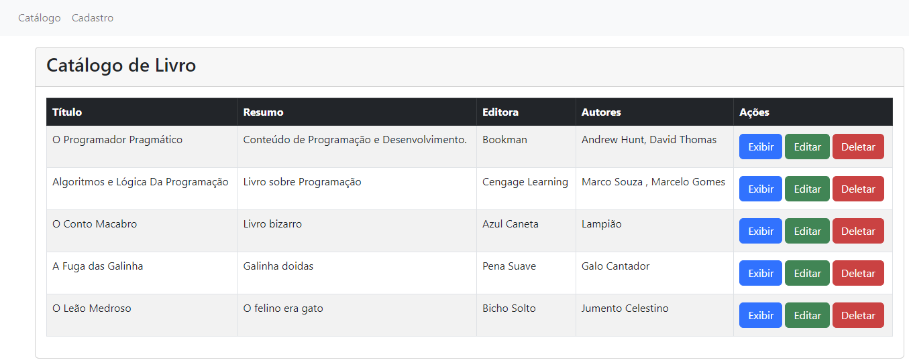

# Instruções para iniciar a aplicação

Um catálogo de livro usando React, Redux, JSON Server, TypeScript, React Router, Toastyfy, Axios e React-Bootstrap

# Passos 

Esta aplicação uutiliza o JSON server como fake backend api. Instale o pacote primeiro com o seguinte comando:

## `npm install -g json-server`

navegue até o diretório 'json-server' e execute o seguinte comando:

## `json-server -p 8000 db.json`

Este comando irá iniciar o fake backed api na port 8000

Talvez seja necessário executar o procedimento abaixo para permitir a execução do script do json-server no Windows. Execute o procedimento com permissão de administrador no console CMD.

## `- Set-ExecutionPolicy RemoteSigned
- get-ExecutionPolicy`

Se o retorno for "RemoteSigned" o json-server pode ser iniciado sem problema.

Retorne ao diretório raiz e execute o seguinte comando:

## `npm install`

Após esse ultimo comando a aplicação poderá ser visualizada no endereço http://localhost:3000/

## `npm start`

